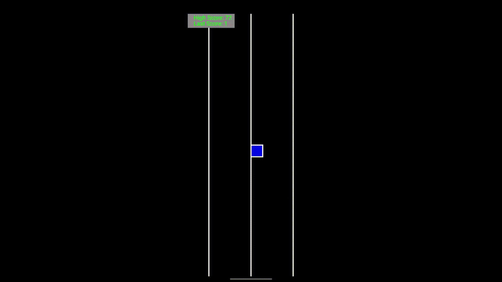

# Android Lane Surfer Game

This project aims to create an Android game using pure Android Studio without relying on any external game engine. This minimalist approach allows the game to be very lightweight, only taking up about 1.6MB of memory.

   <!-- replace with your actual screenshot -->

## Project Description

Lane Surfer is an engaging and challenging game where the player controls a surfer who needs to navigate different lanes to avoid blocks. The game includes features like player movement, block generation, score computation, and game over conditions.

The game was built purely in Android Studio, using standard Android libraries only. The objective was to create a lightweight mobile game without the overhead of heavy game engines.

## Getting Started

### Prerequisites

- Android Studio (latest version)
- Android SDK
- A physical Android device or emulator for testing

### Installation

1. Clone this repository to your local machine.
2. Open the project in Android Studio.
3. Build the project and run it on your Android device or emulator.

## Features

- **Lane-Based Gameplay**: The game is set in a three-lane environment where the player has to surf between lanes to avoid blocks.

- **Player Movement**: The player can jump and move across lanes using touch-based interactions.

- **Block Generation**: Blocks are the primary obstacles in the game. They are generated at random intervals in one of the lanes, and the player has to avoid them to keep playing. If a block passes the player without collision, the player gains a score point.

- **Score Keeping**: The game keeps track of the player's current score, high score, and the last score achieved in previous games.

- **Game Over Conditions**: The game ends when the player collides with a block or moves off-screen. When the game is over, the high score and last score are updated.

- **Game State Management**: The game maintains its state across different runs using Android's SharedPreferences. This means that the high score and last score are not lost even when the game is closed.

- **Lightweight**: Built without heavy game engines or external libraries, the game only takes up about 1.6MB of memory, making it lightweight and efficient.
